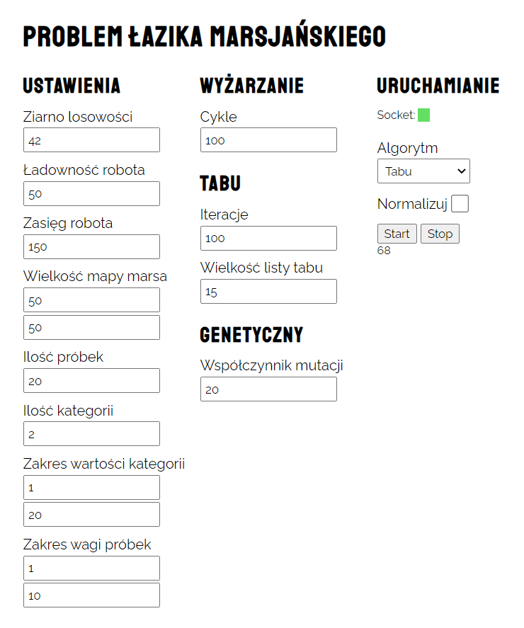
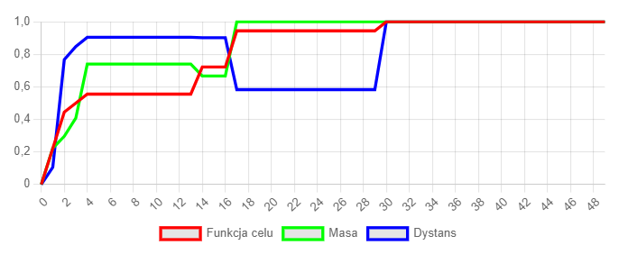

# Problem łazika marsjańskiego

Algorytmy wyżarzania, tabu i genetyczny dla rozwiązania problemu łazika marsjańskiego.

W projekcie zawiera się również aplikacja do uruchamiania solverów i obserwacji wyników w czasie rzeczywistym.

## Uruchamianie

### Backend

Wymaga języka Python (stworzono na wersji 3.8.9)

1. `pip install -r requirement.txt` (instalacja wymaganych paczek)
2. `py server.py` (uruchomienie serwera)

### Frontend

Wymaga Node.js (stworzono na wersji 14.16.1)

1. `cd app` `npm i` `npm run build` (kompilacja plików przez Svelte)
2. `npm run start` (uruchomienie serwera)
